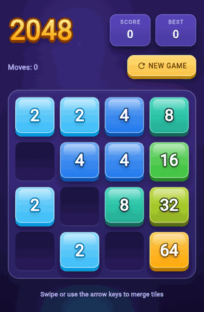
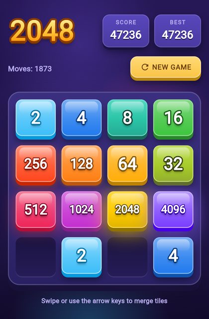
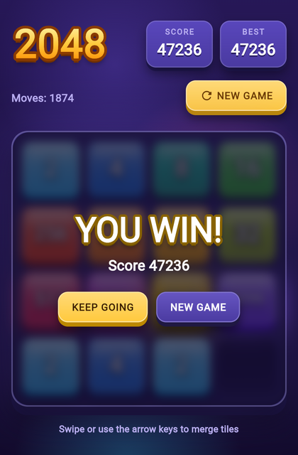
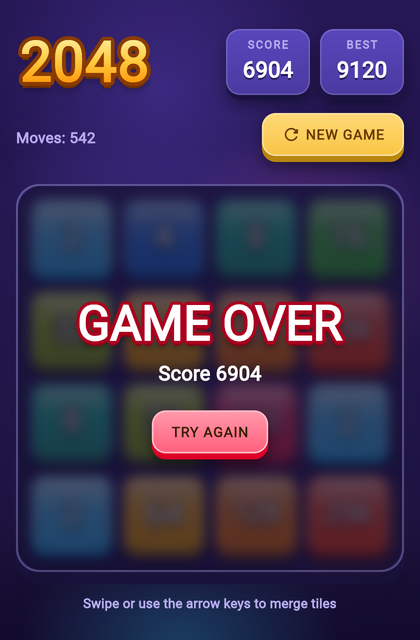

# 2048 Flutter

A classic 2048 sliding tile puzzle game built with Flutter, with glossy 3D tiles and game-style animations.

<p align="center">
  
</p>

| Tiles | You win | Game over |
| :---: | :---: | :---: |
|  |  |  |

## How It Works

### Gameplay

- **Swipe** in any direction (up, down, left, right) to slide all tiles on the board.
- When two tiles with the **same number** collide, they **merge into one** tile with their combined value.
- After each move, a new tile (2 or 4) appears on a random empty cell.
- The goal is to create a tile with the value **2048**.
- The game ends when no more moves are possible (the board is full and no adjacent tiles can merge).

### Scoring

- Each time two tiles merge, the resulting value is added to your score.
- For example, merging two 16 tiles adds 32 to your score.

### Controls

- **Swipe gestures**: Slide tiles in the desired direction on mobile.
- **Arrow keys / WASD**: Slide tiles on web and desktop.
- **New Game button**: Restart the game at any time.

## Architecture

The app follows a simple separation between game logic and UI:

```
lib/
  main.dart                 # App entry point, theme, background
  board_controller.dart     # Game logic: board state, moves, merging, scoring
  game_grid.dart            # UI: board, input handling, animations, win/lose overlay
  game_theme.dart           # Colour palette and shading helpers
  widgets/
    block_tile.dart         # 3D tile block and recessed empty socket
    hud.dart                # Logo, score panels, push button, background
    outlined_text.dart      # Outlined, extruded "cartoon" text
```

- **`BoardController`** manages the 4x4 grid, slides and merges tiles in all four directions, tracks score and move count, detects win/game-over conditions, and spawns new tiles. Each move also records which tiles moved where, which cells merged and where the new tile spawned, so the UI can animate it.
- **`GameGrid`** handles swipe and keyboard input and plays each move in two phases: tiles slide to their new cells, then merged tiles bounce (with a burst of light) and new tiles spring in. It also shows the score panels and the win/game-over overlay.

## Getting Started

### Prerequisites

- Flutter SDK 3.10 or later
- Dart 3.0 or later

### Run

```bash
flutter pub get
flutter run
```

### Test

```bash
flutter test
```

## Features

- Glossy 3D tiles with outlined numbers; tiles from 128 upward glow
- Tiles slide to their new cells, merged tiles bounce, new tiles pop in
- Score, best score (for the current session) and move counter, with floating "+N" score gains
- Frosted in-board overlays for winning (keep going or start over) and game over
- 3D push button for starting a new game
- Swipe, arrow-key and WASD controls, with haptic feedback on mobile
