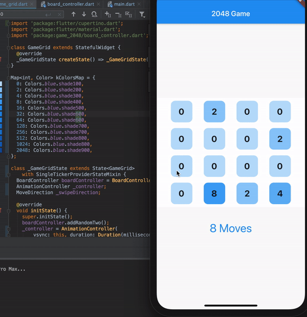

# 2048 Flutter

A classic 2048 sliding tile puzzle game built with Flutter.



## How It Works

### Gameplay

- **Swipe** in any direction (up, down, left, right) to slide all tiles on the board.
- When two tiles with the **same number** collide, they **merge into one** tile with their combined value.
- After each move, a new tile (2 or 4) appears on a random empty cell.
- The goal is to create a tile with the value **2048**.
- The game ends when no more moves are possible (the board is full and no adjacent tiles can merge).

### Scoring

- Each time two tiles merge, the resulting value is added to your score.
- For example, merging two 16 tiles adds 32 to your score.

### Controls

- **Swipe gestures**: Slide tiles in the desired direction on mobile.
- **New Game button** (refresh icon): Restart the game at any time.

## Architecture

The app follows a simple separation between game logic and UI:

```
lib/
  main.dart             # App entry point, theme configuration
  board_controller.dart # Game logic: board state, moves, merging, scoring
  game_grid.dart        # UI: game board, tiles, animations, dialogs
```

- **`BoardController`** manages the 4x4 grid, handles tile sliding and merging for all four directions using a transpose-and-slide approach, tracks score and move count, detects win/game-over conditions, and spawns new tiles.
- **`GameGrid`** renders the board using gesture detection for swipe input, animated tile transitions, score/move displays, and game over/win dialog popups.

## Getting Started

### Prerequisites

- Flutter SDK 3.10 or later
- Dart 3.0 or later

### Run

```bash
flutter pub get
flutter run
```

### Test

```bash
flutter test
```

## Features

- Smooth tile slide animations
- Score and move counter
- Game Over dialog when no moves remain
- Win dialog when 2048 is reached
- New Game restart button
- Material 3 themed UI with classic 2048 color palette
